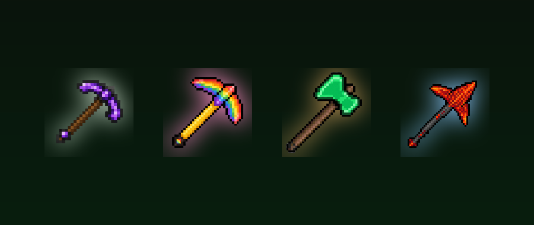

# Pickaxe on Koke

**Five mining tools for Bedrock: 3x3 excavator, vein miner, rainbow pickaxe, lumberjack axe and tunnel bore.**

---

Craft powerful tools that break whole areas at once. Everything is craftable in a crafting table; the tools are unbreakable-ish (high durability) and glow with a custom look.

## What it does

- **Excavator Pickaxe** - mines a 3x3 plane in your viewing direction
- **Vein Miner Pickaxe** - mines a whole connected ore vein at once
- **Rainbow Pickaxe** - mines a 3x3x3 cube
- **Lumberjack Axe** - fells the whole tree
- **Tunnel Bore** - bores a tunnel in the direction you are looking
- Chests, furnaces, spawners, portals, command blocks and bedrock are never destroyed - every block is re-checked right before it breaks
- Breaking is spread across ticks (max 24 blocks per tick) so large areas do not lag the world

## Download

Download **`Pickaxe-on-Koke-v2.18.2.mcaddon`** from the [releases page](../../releases) (or straight from this repository) and open it - Minecraft imports the packs.

1. Create or edit a world and open **Add-Ons**.
2. Activate the **Behavior Pack** and the **Resource Pack** of this add-on.
3. Requires Minecraft Bedrock **1.21.110 or newer**.

If items are missing in your world, check the world's *Experiments* page and enable *Beta APIs* and *Holiday Creator Features* as a fallback.

New to this? Follow **[SETUP-HELP.md](SETUP-HELP.md)** - it walks you through installing and starting it.

## Dev Book

Every pack of mine carries a small easter egg: craft the **Dev Book** with **9 logs** (any wood type, 3x3 in a crafting table) and right-click it. It opens like a book: page 1 the credits, page 2 what this mod is, page 3 the GitHub links (Minecraft cannot open links, so they are shown as text). It also sits in the creative inventory under *Equipment*.

## Notes

- Not an official Minecraft product. Not approved by or associated with Mojang or Microsoft.

---

Made by **dev:#2444** - [github.com/hash2444](https://github.com/hash2444) - [pickaxe-on-koke](https://github.com/hash2444/pickaxe-on-koke)
